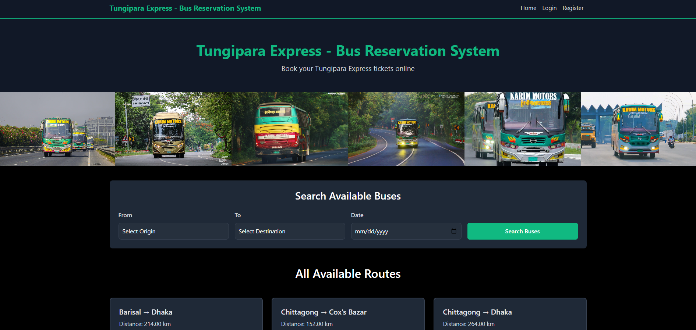

# 🚌 Tungipara Express - Bus Reservation System

<div align="center">
  
  
  <p><i>A comprehensive bus ticket reservation system with real-time seat management</i></p>
  
  <a href="YOUR_YOUTUBE_VIDEO_LINK_HERE">
    
  </a>
</div>

A comprehensive web-based bus ticket reservation system developed as part of **CSE 3110: Database Systems Laboratory**. This project demonstrates advanced database design principles, real-time seat management, and automated schedule generation for a bus service company.


---

## 📋 Table of Contents

- [Overview](#-overview)
- [Features](#-features)
- [Technology Stack](#-technology-stack)
- [Database Architecture](#-database-architecture)
- [Installation](#-installation)
- [Usage](#-usage)
- [Project Structure](#-project-structure)
- [Screenshots](#-screenshots)
- [Future Enhancements](#-future-enhancements)
- [Contributing](#-contributing)
- [License](#-license)
- [Contact](#-contact)

---

## 🎯 Overview

The **Tungipara Express Bus Reservation System** is a full-featured platform designed to manage bus operations, route planning, schedule management, and ticket bookings with real-time seat availability tracking. The system provides two distinct interfaces:

- **User Portal**: Customers can search buses, book tickets, view booking history, and manage their profiles
- **Admin Portal**: Administrators manage buses, routes, schedules, and booking confirmations

This project emphasizes database design fundamentals including normalization, entity relationships, constraints, and complex SQL queries while maintaining a user-friendly interface.

---

## ✨ Features

### 👥 For Users

- **🔍 Smart Search**: Search available buses by origin, destination, and travel date
- **📅 Real-Time Availability**: View live seat availability for all schedules
- **🎫 Easy Booking**: Book tickets with instant booking reference generation
- **📊 Booking History**: Track all bookings with detailed trip information
- **👤 Profile Management**: Update personal information and change password
- **🔐 Secure Authentication**: User registration and login system with session management

### 🛠️ For Administrators

- **🚌 Bus Management**: Add, edit, and delete buses with capacity and type details
- **🛣️ Route Management**: Create and manage routes between cities with distance tracking
- **📆 Master Schedules**: Define weekly schedule patterns for automatic generation
- **⏰ Schedule Management**: Manage actual date-wise schedules
- **✅ Booking Confirmation**: Approve or cancel customer bookings
- **🔄 Auto-Generation**: Automatic schedule creation for the next 7 days based on weekly patterns

### 🔒 Security Features

- Session-based authentication system
- Role-based access control (User/Admin)
- SQL injection prevention using prepared statements
- Input validation and sanitization
- Password hashing for secure storage

---

## 💻 Technology Stack

| Component              | Technology                     |
| ---------------------- | ------------------------------ |
| **Backend**            | PHP 8.0+                       |
| **Database**           | MySQL 8.0+                     |
| **Frontend**           | HTML5, CSS3, JavaScript (ES6+) |
| **CSS Framework**      | Bootstrap 5                    |
| **Icons**              | Bootstrap Icons                |
| **Server**             | Apache (XAMPP)                 |
| **Session Management** | PHP Sessions                   |
| **Timezone**           | Asia/Dhaka (Bangladesh)        |

---

## 🗄️ Database Architecture

### Entity-Relationship Model

The system uses a normalized relational database with 6 main entities:

#### 1. **Users** (`users`)

Stores customer and admin account information.

| Field      | Type         | Description            |
| ---------- | ------------ | ---------------------- |
| user_id    | INT (PK)     | Unique user identifier |
| username   | VARCHAR(50)  | Unique username        |
| email      | VARCHAR(100) | Email address (unique) |
| password   | VARCHAR(255) | Hashed password        |
| phone      | VARCHAR(15)  | Contact number         |
| full_name  | VARCHAR(100) | Full name              |
| user_type  | ENUM         | 'admin' or 'user'      |
| created_at | TIMESTAMP    | Account creation time  |

#### 2. **Buses** (`buses`)

Contains all bus fleet information.

| Field      | Type         | Description                  |
| ---------- | ------------ | ---------------------------- |
| bus_id     | INT (PK)     | Unique bus identifier        |
| bus_number | VARCHAR(20)  | Registration number (unique) |
| bus_name   | VARCHAR(100) | Bus name/model               |
| capacity   | INT          | Total seat capacity          |
| bus_type   | ENUM         | 'AC' or 'Non-AC'             |
| created_at | TIMESTAMP    | Record creation time         |

#### 3. **Routes** (`routes`)

Defines travel routes between cities.

| Field       | Type          | Description             |
| ----------- | ------------- | ----------------------- |
| route_id    | INT (PK)      | Unique route identifier |
| origin      | VARCHAR(100)  | Starting city           |
| destination | VARCHAR(100)  | Ending city             |
| distance_km | DECIMAL(10,2) | Distance in kilometers  |
| created_at  | TIMESTAMP     | Record creation time    |

#### 4. **Master Schedules** (`master_schedules`)

Weekly schedule templates for automatic generation.

| Field              | Type          | Description         |
| ------------------ | ------------- | ------------------- |
| master_schedule_id | INT (PK)      | Unique identifier   |
| bus_id             | INT (FK)      | Reference to buses  |
| route_id           | INT (FK)      | Reference to routes |
| day_of_week        | ENUM          | Sunday to Saturday  |
| departure_time     | TIME          | Departure time      |
| arrival_time       | TIME          | Arrival time        |
| fare               | DECIMAL(10,2) | Ticket price        |

**Constraint**: Each bus can only run once per day (unique constraint on bus_id + day_of_week)

#### 5. **Schedules** (`schedules`)

Actual date-specific trip schedules.

| Field              | Type          | Description                           |
| ------------------ | ------------- | ------------------------------------- |
| schedule_id        | INT (PK)      | Unique identifier                     |
| master_schedule_id | INT (FK)      | Source template                       |
| bus_id             | INT (FK)      | Reference to buses                    |
| route_id           | INT (FK)      | Reference to routes                   |
| travel_date        | DATE          | Date of travel                        |
| departure_time     | TIME          | Departure time                        |
| arrival_time       | TIME          | Arrival time                          |
| available_seats    | INT           | Current available seats               |
| fare               | DECIMAL(10,2) | Ticket price                          |
| status             | ENUM          | 'scheduled', 'cancelled', 'completed' |

#### 6. **Bookings** (`bookings`)

All ticket booking records.

| Field             | Type         | Description                                      |
| ----------------- | ------------ | ------------------------------------------------ |
| booking_id        | INT (PK)     | Unique booking identifier                        |
| schedule_id       | INT (FK)     | Reference to schedules                           |
| user_id           | INT (FK)     | Reference to users                               |
| passenger_name    | VARCHAR(100) | Traveler's name                                  |
| passenger_email   | VARCHAR(100) | Passenger email                                  |
| passenger_phone   | VARCHAR(15)  | Contact number                                   |
| seat_number       | VARCHAR(10)  | Assigned seat                                    |
| booking_reference | VARCHAR(20)  | Unique booking code                              |
| booking_time      | TIMESTAMP    | Booking creation time                            |
| status            | ENUM         | 'pending', 'confirmed', 'cancelled', 'completed' |

### Key Relationships

```
users (1) ──────── (M) bookings
buses (1) ──────── (M) master_schedules
buses (1) ──────── (M) schedules
routes (1) ──────── (M) master_schedules
routes (1) ──────── (M) schedules
master_schedules (1) ──── (M) schedules (template relationship)
schedules (1) ──────── (M) bookings
```

### Database Features

- **Foreign Key Constraints**: Ensures referential integrity
- **Unique Constraints**: Prevents duplicate records (emails, booking references, route pairs)
- **Check Constraints**: Validates data (capacity > 0, fare > 0, distance > 0)
- **Indexes**: Optimizes query performance on frequently searched columns
- **Cascading Actions**: Automatic updates/deletes for related records
- **Default Values**: Auto-timestamps and status defaults

---

## 🚀 Installation

### Prerequisites

- **XAMPP** (or any Apache + MySQL + PHP stack)
- **PHP 8.0** or higher
- **MySQL 8.0** or higher
- Modern web browser

### Step-by-Step Setup

1. **Clone the Repository**

   ```bash
   git clone https://github.com/niloy2107028/Tungipara-Express-Bus-Reservation-System.git
   ```

2. **Move to XAMPP Directory**

   ```bash
   # Windows
   move Tungipara-Express-Bus-Reservation-System C:\xampp\htdocs\

   # Linux/Mac
   sudo mv Tungipara-Express-Bus-Reservation-System /opt/lampp/htdocs/
   ```

3. **Start XAMPP Services**

   - Open XAMPP Control Panel
   - Start **Apache** and **MySQL** services

4. **Configure Database**

   - Open `config.php` and verify database credentials:

   ```php
   define('DB_HOST', 'localhost');
   define('DB_USER', 'root');
   define('DB_PASS', '');
   define('DB_NAME', 'bus_reservation_system');
   ```

5. **Setup Database**

   - Open your browser and navigate to:

   ```
   http://localhost/Tungipara-Express-Bus-Reservation-System/setup_database.php
   ```

   - This will create the database and all tables automatically

6. **Insert Demo Data** (Optional)

   - Navigate to:

   ```
   http://localhost/Tungipara-Express-Bus-Reservation-System/insert_demo_data.php
   ```

   - This will populate the database with sample data including:
     - Admin and user accounts
     - Sample buses and routes
     - Weekly schedule patterns
     - Automatically generated schedules

7. **Access the Application**
   - Homepage: `http://localhost/Tungipara-Express-Bus-Reservation-System/`
   - Login: `http://localhost/Tungipara-Express-Bus-Reservation-System/login.php`

### Default Credentials

**Admin Account:**

- Username: `admin`
- Password: `admin123`

**User Account:**

- Username: `user`
- Password: `user123`

> ⚠️ **Security Note**: Change default passwords immediately in production environments.

---

## 📖 Usage

### For Customers

1. **Register an Account**

   - Click "Register" on the homepage
   - Fill in your details (name, email, phone, password)
   - Submit the registration form

2. **Search for Buses**

   - Select origin city, destination city, and travel date
   - Click "Search Buses" to view available schedules
   - View real-time seat availability and fares

3. **Book a Ticket**

   - Click "Book Now" on your preferred schedule
   - Enter passenger details
   - Submit booking to receive a unique booking reference

4. **View Bookings**
   - Go to "My Dashboard" to see all your bookings
   - Check booking status (Pending/Confirmed/Cancelled)
   - View trip details and passenger information

### For Administrators

1. **Login as Admin**

   - Use admin credentials to access the admin portal
   - Navigate through the admin dashboard

2. **Manage Buses**

   - Add new buses with capacity and type
   - Edit existing bus information
   - Delete buses (only if no schedules exist)

3. **Manage Routes**

   - Create new routes between cities
   - Update route distances
   - View all available routes

4. **Setup Master Schedules**

   - Define weekly patterns (which bus runs on which day)
   - Set departure/arrival times and fares
   - System automatically generates actual schedules for next 7 days

5. **Manage Schedules**

   - View all generated schedules
   - Edit individual schedules if needed
   - Monitor seat availability

6. **Confirm Bookings**
   - Review pending bookings
   - Confirm or cancel bookings
   - System automatically updates seat availability

---

## 📁 Project Structure

```
Tungipara-Express-Bus-Reservation-System/
│
├── admin/                          # Admin portal pages
│   ├── includes/
│   │   └── admin_nav_cards.php    # Admin navigation cards
│   ├── add_bus.php                # Add new bus
│   ├── edit_bus.php               # Edit bus details
│   ├── buses.php                  # View all buses
│   ├── routes.php                 # Manage routes
│   ├── edit_route.php             # Edit route
│   ├── master_schedules.php       # Weekly schedule patterns
│   ├── edit_master_schedule.php   # Edit master schedule
│   ├── schedules.php              # View all schedules
│   ├── edit_schedule.php          # Edit schedule
│   └── bookings.php               # Manage bookings
│
├── user/                          # User portal pages
│   ├── dashboard.php              # User dashboard
│   ├── profile.php                # User profile management
│   └── book_ticket.php            # Ticket booking page
│
├── includes/                      # Shared includes
│   ├── db_connect.php             # Database connection
│   ├── functions.php              # Helper functions
│   ├── header.php                 # Common header
│   ├── footer.php                 # Common footer
│   └── auto_regenerate_schedules.php  # Auto schedule generator
│
├── assets/                        # Static assets
│   ├── css/
│   │   └── style.css             # Custom styles
│   └── js/
│       └── script.js             # Custom JavaScript
│
├── Photos/                        # Image assets
│
├── config.php                     # Configuration file
├── index.php                      # Homepage
├── login.php                      # Login page
├── logout.php                     # Logout handler
├── register.php                   # Registration page
├── search_results.php             # Search results page
├── setup_database.php             # Database setup script
├── insert_demo_data.php           # Demo data insertion
└── README.md                      # This file
```

---

## 🖼️ Screenshots

> Add screenshots of your application here showcasing:
>
> - Homepage with search functionality
> - Search results with available buses
> - Booking form
> - User dashboard
> - Admin panel - Bus management
> - Admin panel - Schedule management
> - Admin panel - Booking management

---

## 🎯 Key Project Goals

1. ✅ **Easy Booking**: Simple online ticket booking without hassle
2. ✅ **Real-Time Updates**: Accurate seat availability to prevent overbooking
3. ✅ **Automated Scheduling**: Auto-generate schedules for next 7 days from weekly patterns
4. ✅ **Simple Management**: Intuitive admin interface for all operations
5. ✅ **Data Safety**: Properly normalized database with foreign key relationships
6. ✅ **User-Friendly**: Clean UI/UX for both customers and administrators

---

## 🔮 Future Enhancements

- [ ] **Online Payment Integration**: Integrate payment gateways (SSLCommerz, bKash, Nagad)
- [ ] **Email Notifications**: Send booking confirmations via email
- [ ] **SMS Alerts**: Send booking updates via SMS
- [ ] **Route Analytics**: Dashboard with revenue reports and popular routes
- [ ] **Seat Selection**: Visual seat map for seat selection
- [ ] **Dynamic Pricing**: Implement surge pricing based on demand
- [ ] **Mobile App**: Develop native mobile applications
- [ ] **Multi-language Support**: Add Bengali and other languages
- [ ] **Review System**: Allow users to rate and review trips
- [ ] **GPS Tracking**: Real-time bus location tracking
- [ ] **Cancellation Management**: Automated refund processing
- [ ] **Export Reports**: PDF/Excel export for bookings and revenues

---

## 🤝 Contributing

Contributions are welcome! If you'd like to contribute to this project:

1. Fork the repository
2. Create a new branch (`git checkout -b feature/YourFeature`)
3. Commit your changes (`git commit -m 'Add some feature'`)
4. Push to the branch (`git push origin feature/YourFeature`)
5. Open a Pull Request

Please ensure your code follows the existing style and includes appropriate comments.

---

## 📄 License

This project is licensed under the **MIT License** - see the [LICENSE](LICENSE) file for details.

---

## 👨‍💻 Contact

**Sohaib Hasan Niloy**

- Roll: 2107028
- Year: 3rd, Semester: 1st
- Department: Computer Science and Engineering
- GitHub: [@niloy2107028](https://github.com/niloy2107028)

---

## 🙏 Acknowledgments

- **Course**: CSE 3110 - Database Systems Laboratory
- **Institution**: Department of Computer Science and Engineering
- Special thanks to course instructors and peers for guidance and feedback

---

## 📝 Project Report

This project was developed as part of the **CSE 3110: Database Systems Laboratory** course. The complete project report includes:

- Detailed ER diagrams
- Schema diagrams
- Database normalization analysis
- SQL query examples
- System architecture documentation

For the complete report, please refer to the project documentation.

---

<div align="center">

**⭐ If you find this project useful, please consider giving it a star on GitHub! ⭐**

Made with ❤️ by Sohaib Hasan Niloy

</div>
